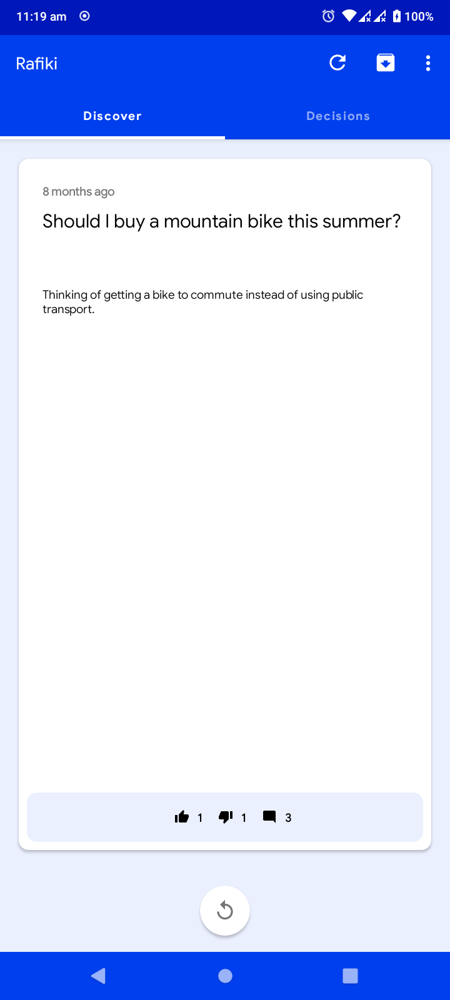
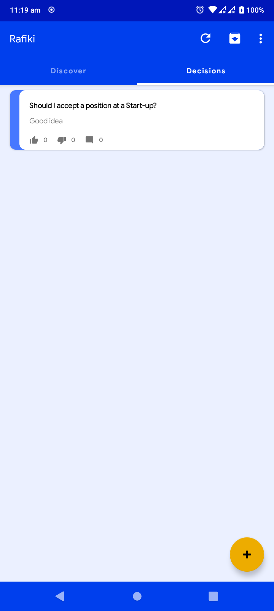
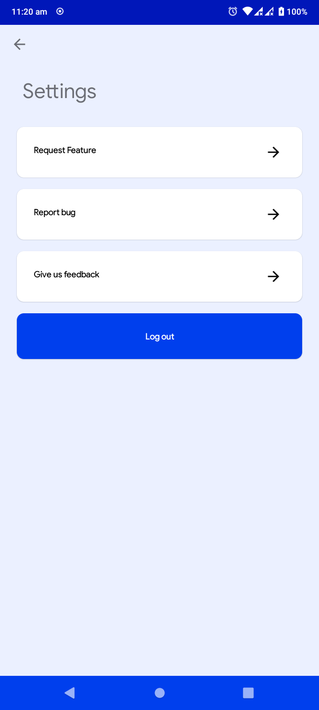
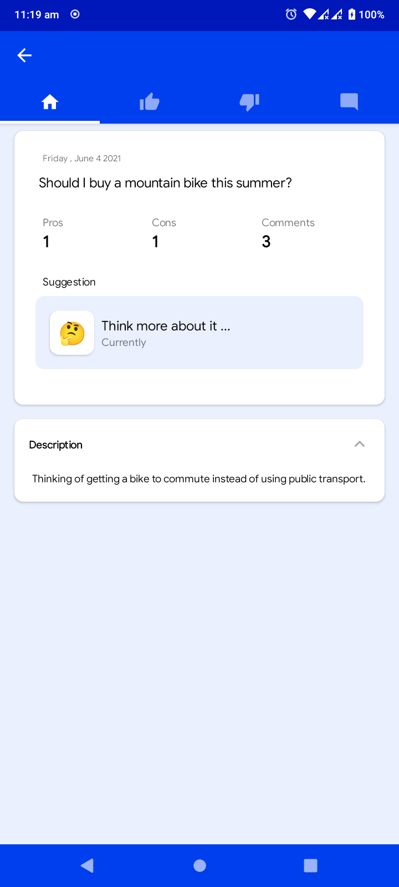
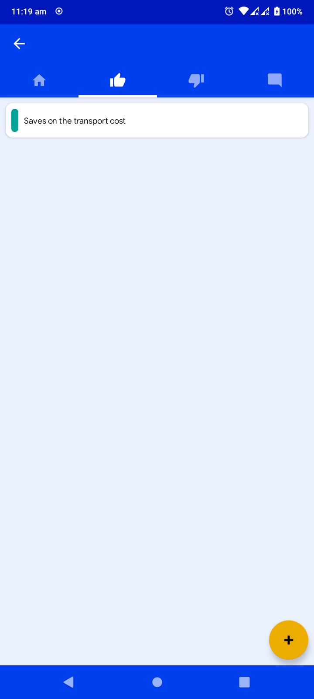
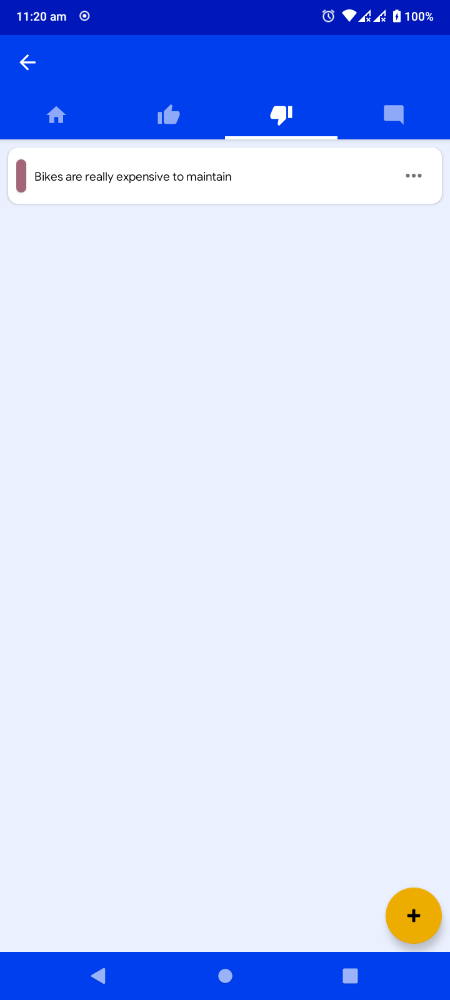
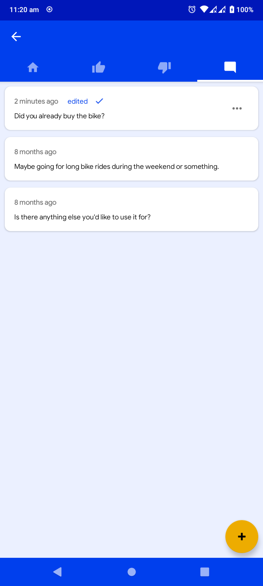

# RAFIKI

[playstore](https://play.google.com/store/apps/details?id=com.mambo.rafiki) 
 
An app that weighs the pros and cons of a decision to help you make the best decision.
 

## Demo

## Features
- create, read, update, delete, publish, unpublish and archive a decision
- create, read, update and delete a pro/con
- highlights pros and cons
- gets other user's thoughts
- show which side it is leaning on either pros or cons

## Setup
Step 1 : Generate a Personal Access Token for GitHub
- Inside you GitHub account:
- Settings -> Developer Settings -> Personal Access Tokens -> Generate new token
- Make sure you select the following scopes (“ read:packages”) and Generate a token
- After Generating make sure to copy your new personal access token. You cannot see it again! The only option is to generate a new key.

Step 2: Store your GitHub — Personal Access Token details
- Create a github.properties file within your root Android project
- In case of a public repository make sure you add this file to .gitignore for keep the token private
- Add properties gpr.usr=GITHUB_USERID and gpr.key=PERSONAL_ACCESS_TOKEN
- Replace GITHUB_USERID with personal / organisation Github User ID and PERSONAL_ACCESS_TOKEN with the token generated in #Step 1

Step 3: Create Firebase Project
- Go to firebase console [here](https://console.firebase.google.com/)
- Click on **create project** and follow the steps
    - add project name and click continue
    - you can enable google analytics or not and click contine
    - choose analytics location, check the box to accept [Google Analytics Terms](https://marketingplatform.google.com/about/analytics/terms/us/) and click create project

Step 4: Add google-services.json
- Once step 4 is finishes click on the **android icon** on the new product page
- register app with the following details
    - Android Package name : com.mambo.rafiki
    - (optional) App nickname : Rafiki
    - (optional) Debug signing certificate SHA-1 : [how to get debug siging certificate](https://stackoverflow.com/questions/27609442/how-to-get-the-sha-1-fingerprint-certificate-in-android-studio-for-debug-mode)
    - click **register app**
- click **download google-services.json** and follow the instructions on the page
- click **next**
- add firebase sdk to your app with the instructions on the page and click **next**
- click **continue to console**

YOU'RE READY TO GO

## Contribution
- Fork the repo, make some awesome changes and create a pull request.
- Come back in a while to check for your merged Pull Request.
- You should receive an email from GitHub when your changes have been approved, or if additional changes are requested. And when the PR is finally merged with the develop and your changes have been added.
- If you found this project **useful** please give it a :star: star :star: at the top of the page and **Tweet** about it to help spread the word 
- You can **follow me** and get in touch on [Twitter](https://twitter.com/mambo_bryan) or [using any of these other options](https://syknapse.github.io/Syk-Houdeib/#contact 'My contact section | Portfolio')
- This is an open source project so you are welcome to help fix bugs, improvements, or new features. Open an [issue](https://help.github.com/articles/creating-an-issue/ 'Mastering Issues | GitHub Guides') or send a new [pull request](https://help.github.com/articles/creating-a-pull-request-from-a-fork/ 'Creating a pull request from a fork | GitHub Help')
- **Thanks for contributing to this project**. Now you can go ahead and try contributing to other projects; look for the  label for beginner-friendly contribution options.

